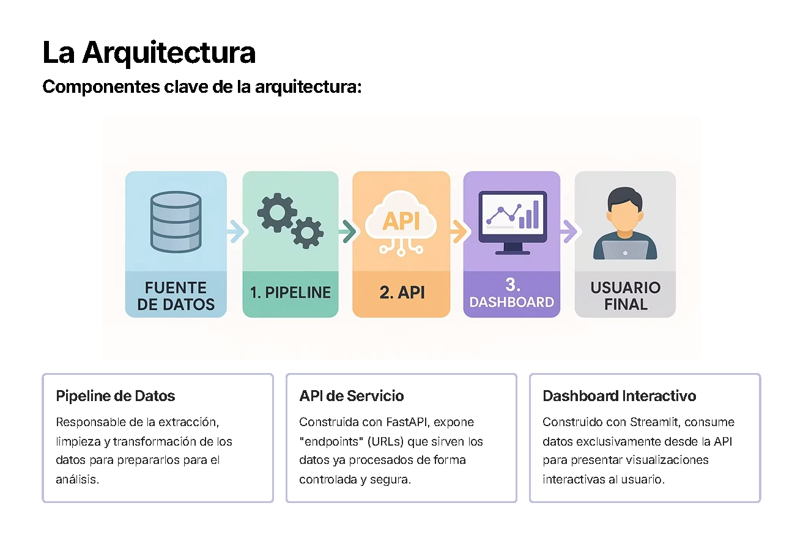
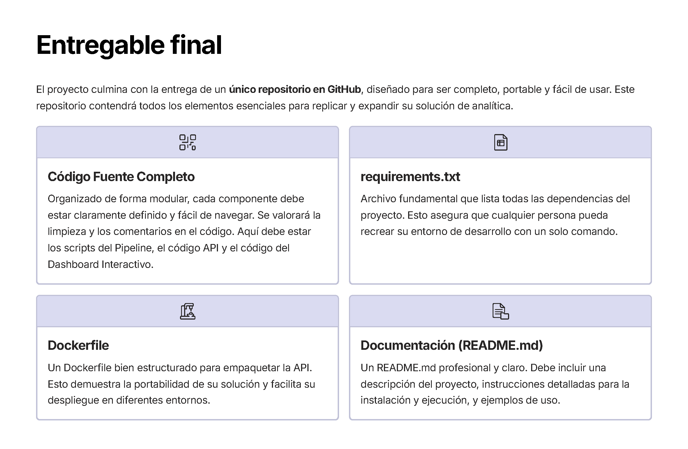
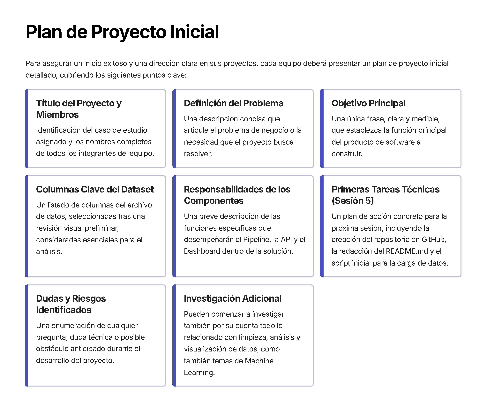

# 📘Guía de Configuración y Flujo de Trabajo – Análisis Musical con Python
**Proyecto:** Análisis de Atributos Musicales y Predicción de Popularidad de Canciones  








## 1. Importar las librerías

Las siguientes librerías son las que se utilizan normalmente en el manejo, análisis y visualización de datos.  

```python
# Manipulación de datos con DataFrames.
import pandas as pd

# Operaciones numéricas y manejo de arrays.
import numpy as np

# Creación de gráficos básicos (líneas, barras, histogramas, etc.).
import matplotlib.pyplot as plt

# Visualización estadística avanzada (mapas de calor, distribuciones).
import seaborn as sns

# Mostrar gráficos directamente en el entorno de Jupyter.
%matplotlib inline

# Modelado y algoritmos de aprendizaje automático.
from sklearn.model_selection import train_test_split
from sklearn.preprocessing import StandardScaler
from sklearn.ensemble import RandomForestClassifier
from sklearn.metrics import accuracy_score, confusion_matrix, classification_report

# Modelos avanzados de boosting.
import xgboost as xgb
import lightgbm as lgb

# Detección y visualización de datos nulos.
import missingno as msno

# Gráficos interactivos para dashboards.
import plotly.express as px
import plotly.graph_objects as go

# Librerías adicionales para entorno Jupyter y manejo interactivo.
from IPython.display import display, HTML
```

**Descripción breve de librerías utilizadas:**
- **pandas**: lectura, limpieza y manipulación de datos tabulares.  
- **numpy**: operaciones matemáticas y manejo de vectores o matrices.  
- **matplotlib**: gráficos de líneas, barras, histogramas, etc.  
- **seaborn**: visualizaciones estadísticas (mapas de calor, distribuciones).  
- **scikit-learn**: modelado y algoritmos de aprendizaje automático.  
- **missingno**: detección y visualización de datos nulos.  
- **plotly**: gráficos interactivos para dashboards.  
- **jupyter**: entorno interactivo para desarrollo y análisis. 
- **xgboost**:	Implementación optimizada del algoritmo de Extreme Gradient Boosting (XGBoost).
- **lightgbm**:	Algoritmo de Gradient Boosting rápido y eficiente desarrollado por Microsoft. 

---

## 2. Configuración del Entorno Virtual

Para aislar las dependencias del proyecto y mantener versiones estables.

```bash
# Paso 1: Crear entorno virtual, v3.13 es la maxima compatible con streamlit
py -3.13 -m venv .venv 

# Paso 2: Activar entorno virtual
.venv\Scripts\activate

#Paso 2a seleccionar interprete de python para el entorno virtual
a) Presionar Ctrl + shift + P
b) Click en Pyhton: Select Interpreter
c) Seleccionar el que tenga el entorno virtual, ej.  Pyhton 3.13.19(.venv) .\.venv\Scripts\python.exe


# Paso 3: Instalar librerías necesarias
pip install pandas numpy matplotlib seaborn scikit-learn jupyter missingno plotly streamlit lightgbm xgboost


# Paso 4: Exportar dependencias instaladas
pip freeze > requirements.txt

# Paso 5: Clonar el repositorio del proyecto
# (Repositorio documentado en 'Github_notes.md')

# Paso 6: Realizar las actividades asignadas
```

Comentarios:
- `.venv` crea un entorno virtual local.  
- `pip freeze` genera un archivo con versiones exactas de librerías.  
- `requirements.txt` permite replicar el entorno en otro equipo fácilmente.  

---

## 3. Flujo del Proyecto (Flow Project)

Este flujo organiza las etapas principales del análisis y modelado.

1. Carga de los datos (dataset).  
2. Análisis Exploratorio de los Datos (EDA).  
3. Preparación y tratamiento previo de los datos.  
4. Visualización gráfica de los datos.  
5. Generación del modelo de aprendizaje automático.  
6. Entrenamiento del modelo de aprendizaje automático.  
7. Definición del modelo predictivo.  
8. Evaluación del modelo entrenado con datos reservados.  

### Ejemplos de comandos en EDA

```python
# Vista inicial del dataset
data.head()

# Dimensiones del set de datos
print("Tamaño del set de datos:", data.shape)

# Información general del dataset
data.info()

# Conteo de valores nulos
data.isnull().sum()

# Conteo de registros duplicados
data.duplicated().sum()
```

Comentarios:
- `data.head()` muestra las primeras filas para verificar estructura.  
- `data.shape` indica cuántas filas y columnas contiene.  
- `data.info()` ayuda a detectar tipos de datos y nulos.  
- `isnull()` y `duplicated()` permiten identificar problemas de calidad.  

### Limpieza de Datos (duplicados y nulos)

```python
# Identificar registros duplicados
duplicated_rows = data[data.duplicated()]
print(duplicated_rows)

# Eliminar filas duplicadas
print("Tamaño antes:", data.shape)
data.drop_duplicates(inplace=True)
print("Tamaño después:", data.shape)

# Identificar valores nulos en la columna 'Artist'
null_artists = data[data['Artist'].isnull()]
print("\nÍndices con artistas nulos:")
print(null_artists.index.tolist())

# Eliminar filas con artistas nulos
print("Nulos antes:", data['Artist'].isnull().sum())
data.dropna(subset=['Artist'], inplace=True)
print("Nulos después:", data['Artist'].isnull().sum())
```

Comentarios:
- `data.duplicated()` localiza registros repetidos.  
- `drop_duplicates()` elimina duplicados sin crear una nueva copia.  
- `dropna()` elimina filas con valores faltantes en columnas clave.  

---

## 4. Enfoque del Análisis Exploratorio

Durante el EDA, se analizan principalmente:
- Datos nulos.  
- Registros duplicados.  
- Valores vacíos o inconsistentes.  
- Distribuciones estadísticas de cada atributo (por ejemplo, energy, danceability, valence).  

Estos pasos aseguran una base de datos limpia antes del modelado.  

---

# Estructura Sugerida Proyecto

```
CASE-STUDY-SPOTIFY/
│
├── data/                     # Datos originales y procesados
│   ├── SpotifyFeatures.csv
│   ├── processed/            # Datasets limpios o con feature engineering
│   │   └── spotify_clean.csv
│
├── models/                   # Modelos entrenados y scripts de entrenamiento
│   ├── random_forest.pkl
│   ├── xgboost_model.json
│   └── lightgbm_model.txt
│
├── notebooks/                # Jupyter Notebooks de análisis
│   ├── 01_loader.ipynb
│   ├── 02_eda.ipynb
│   ├── 03_preprocessing.ipynb
│   ├── 04_model_training.ipynb
│   └── 05_evaluation.ipynb
│
├── notes/                    # Documentación y apuntes
│   ├── img/
│   ├── Github_notes.md
│   ├── Markdown_info.md
│   └── Project Flow.md
│
├── src/                      # Código fuente del proyecto
│   ├── utils/                # Funciones auxiliares reutilizables
│   │   ├── data_loader.py
│   │   ├── preprocess.py
│   │   ├── visualizations.py
│   │   └── model_utils.py
│   └── api/                  # API predictiva (Flask o FastAPI)
│       ├── __init__.py
│       └── routes.py
│
├── results/                  # Resultados del modelo y gráficos
│   ├── figures/              # Gráficos de análisis
│   └── metrics/              # Reportes y tablas de evaluación
│
├── tests/                    # Pruebas unitarias del código
│   ├── test_data_loader.py
│   ├── test_model.py
│   └── test_api.py
│
├── main.py                   # Punto inicial del proyecto
├── .gitignore
├── README.md
├── requirements.txt
└── setup.md                  # Guía de instalación y entorno
```

---

## Recomendaciones

- **processed/**: evita modificar los datos originales; guarda aquí los datasets limpios.  
- **results/**: útil para almacenar gráficas, métricas y comparaciones entre modelos.  
- **utils/**: concentra funciones comunes, como carga de datos, limpieza o visualización.  
- **api/**: te servirá cuando implementes el endpoint `/songs/predict_hit`.  
- **tests/**: si piensas escalar el proyecto o evaluarlo académicamente, esto muestra buenas prácticas.  

---